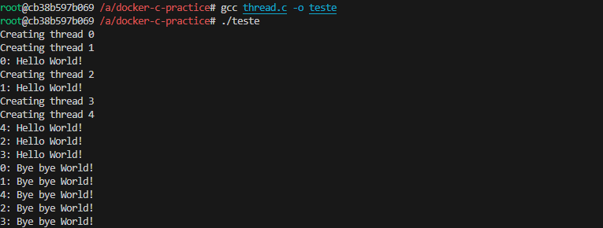

# S.O. 2025.1 - Atividade 03 - Compilação de código dentro de docker fedora

**Nome**: Isabella Camilli Meletani 
**Data**: 16/05/2025

## 1. Objetivo

Esta prática teve como objetivo introduzir o uso de containers Docker como uma ferramenta para criação de ambientes de desenvolvimento isolados, especialmente voltados à programação em C e à execução de tarefas relacionadas ao estudo de Sistemas Operacionais. A proposta foi construir uma imagem personalizada baseada no Fedora, contendo o compilador **gcc** e outras ferramentas essenciais, permitindo compilar e executar programas em C de forma independente do sistema operacional do host.

## 2. Passos executados

Após a preparação do ambiente local, iniciei a prática criando um diretório específico para o projeto, chamado `docker-c-practice`. Dentro dessa pasta, salvei o Dockerfile com as instruções necessárias para configurar o ambiente Fedora com suporte à linguagem C.

Em seguida, executei o container com o volume mapeado para que o diretório atual do host fosse refletido dentro do container no caminho /app no terminal interativo do container, já dentro do shell fish.

 Em seguida, executei manualmente o comando `dnf install gcc`, esse passo foi necessário para garantir que o compilador gcc estivesse instalado no ambiente e pudesse ser utilizado para compilar os programas em C. A instalação foi concluída com sucesso, permitindo a continuação da prática normalmente.

A seguir para testar a compilação e execução de um programa em C dentro do container, utilizei um exemplo clássico de criação de processo com uso das chamadas de sistema `fork()`, `wait()` e `execve()`.

O código-fonte criado e compilado tem como objetivo demonstrar o comportamento de processos pai e filho em ambientes Unix-like. Ele funciona da seguinte forma:

1. **`fork()`** é chamado para criar um novo processo. O processo original se torna o *pai* e o novo processo gerado é o *filho*.
2. Se `fork()` retornar um valor negativo, significa que a criação do processo falhou.
3. Se retornar um valor positivo, o processo atual é o *pai*, que então chama `wait()` para aguardar o término do processo filho.
4. O processo *filho*, por sua vez, chama `execve()` para substituir sua imagem de processo atual pela execução do comando `/bin/date`, que exibe a data e hora atual do sistema.
5. Se `execve()` falhar, o erro é exibido com `perror()`.
6. Após a execução de qualquer dos processos (pai ou filho), imprime-se "Tchau !" antes de sair com `exit(0)`.

A saída esperada foi a data e hora atual (proveniente do date), seguida da mensagem Tchau !, indicando que ambos os processos finalizaram corretamente.

Para ampliar o estudo sobre processos e concorrência, executei um programa em C que utiliza a biblioteca **pthread** para criar múltiplas threads. O código cria cinco threads simultâneas, cada uma executando a função `print_hello`.

O funcionamento do programa é o seguinte:

- Cada thread imprime uma mensagem inicial `"Hello World!"` com seu identificador.
- Em seguida, a thread dorme por 5 segundos (`sleep(5)`), simulando uma tarefa que leva tempo para ser concluída.
- Após o sono, a thread imprime uma mensagem final `"Bye bye World!"` e encerra sua execução com `pthread_exit(NULL)`.
- No `main()`, todas as threads são criadas em um laço `for`, e o processo principal encerra a sua thread principal também com `pthread_exit(NULL)`, para garantir que as threads criadas tenham tempo de execução.

Este exemplo demonstra a criação e sincronização básica de threads, um conceito fundamental para a programação concorrente e para sistemas operacionais que precisam gerenciar múltiplas tarefas simultaneamente.

Finalizando a atividade, eu saí do container utilizando o comando `exit`.

## 3. Conclusão

A realização desta prática proporcionou uma compreensão mais aprofundada sobre o uso de containers Docker como ambientes isolados para desenvolvimento e execução de programas em C, além de facilitar o aprendizado dos conceitos fundamentais, como criação e gerenciamento de processos e threads. A experiência de configurar o ambiente, compilar e executar códigos que envolvem chamadas ao sistema (fork, execve, pthread) evidenciou a importância da virtualização leve para garantir portabilidade e reprodutibilidade dos experimentos. Além disso, o uso de Docker permitiu que todo o processo fosse realizado de forma controlada, independente do sistema operacional do host, tornando-se uma ferramenta valiosa para o desenvolvimento acadêmico e profissional.